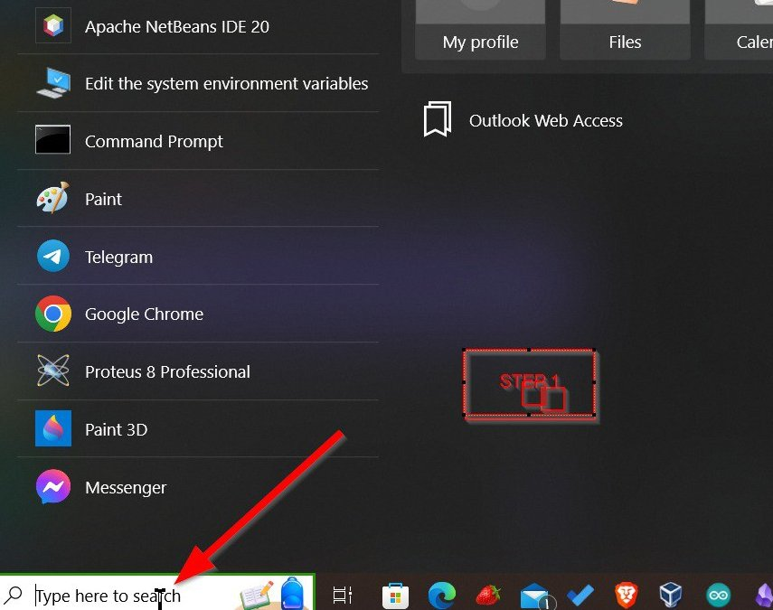
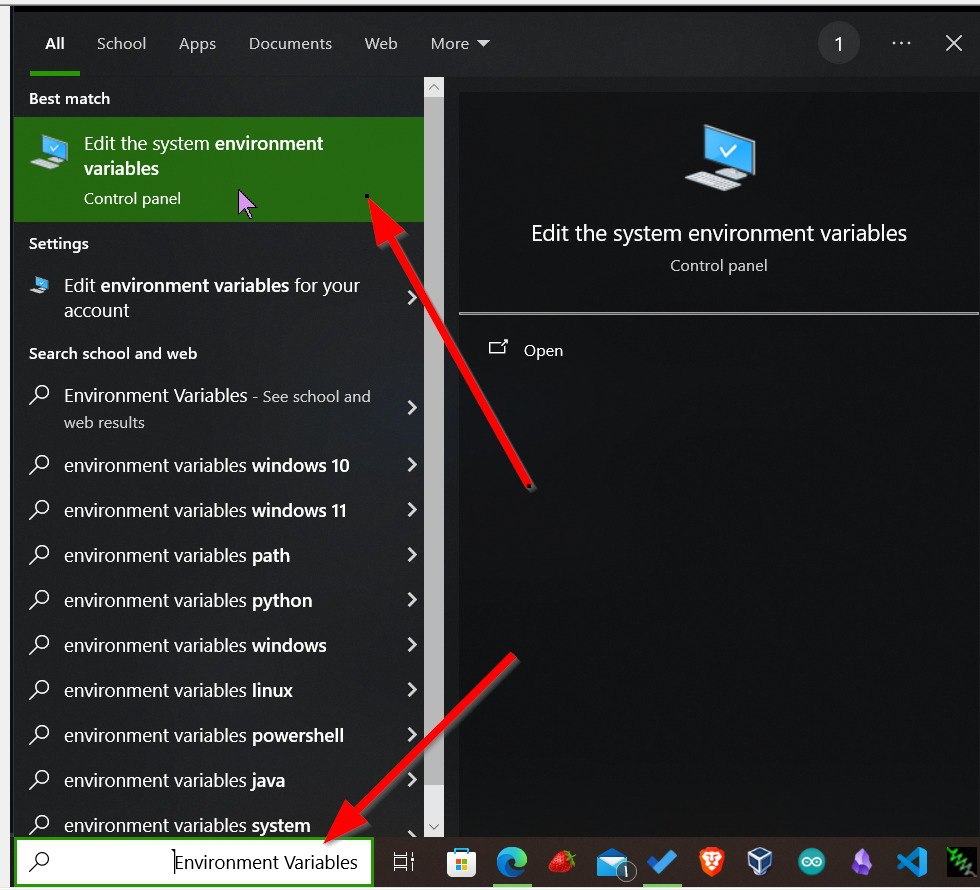
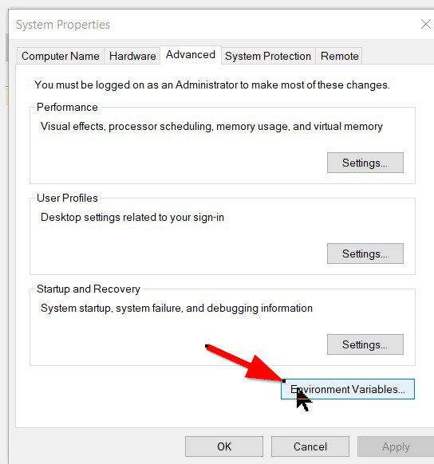
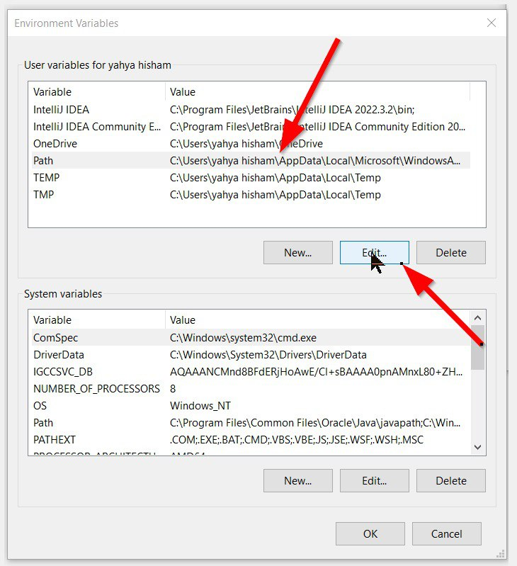
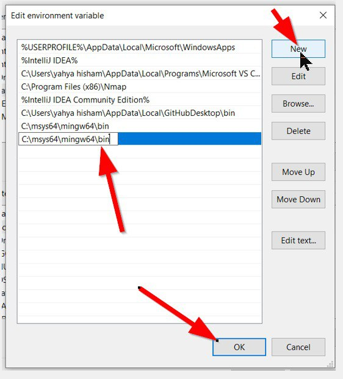

# Changing PATH   

1. Search for environment variables in start menu and open it.

  

2. Click on Environment Variables button.

3. Click on PATH and click edit. 

4. Click on new.

5. Add this string `C:\msys64\mingw64\bin`

